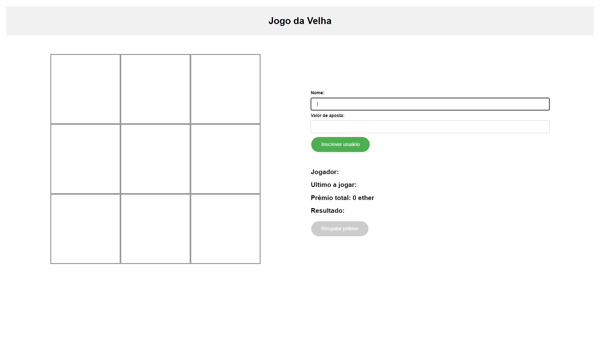

# tic-tac-toe_dapp

Aplicação de jogo da velha com front-end em react e com servidor descentralizado em Blockchain.

Como Jogar:

- Cada jogador faz se inscreve e coloca um valor em ether para apostar através de sua wallet;
- Um jogador joga após a transação anterior referente a jogada do outro jogador ter sido finalizada;
- Quem ganhar o jogo da velha, recebe o montante total apostado em ether na sua wallet própria.

